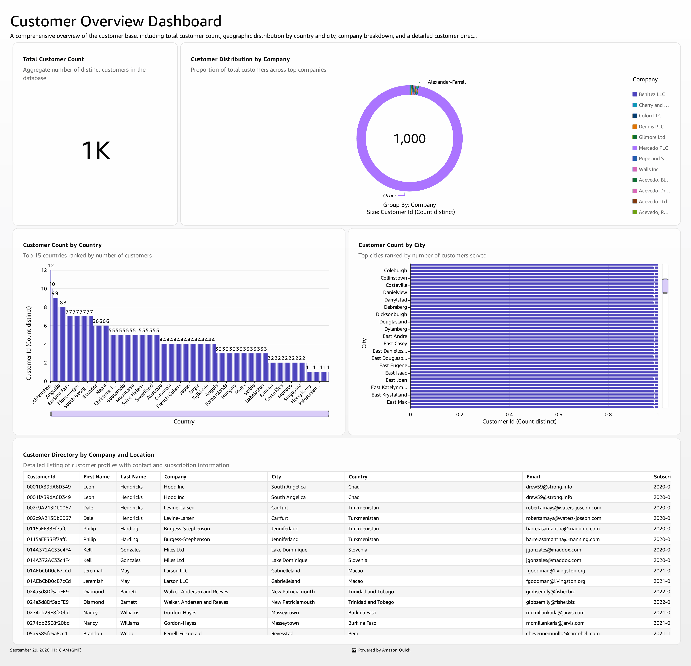
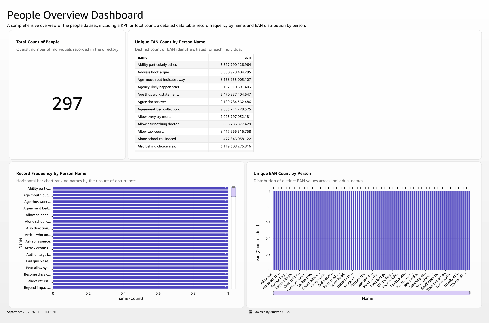

# Cost-Of-Core-Analytics

A Serverless Healthcare Data Engineering Project using Event-Driven Pipeline with AWS (S3, Lambda, SQS, Aurora, SNS, QuickSight).

## 📌 Architecture Diagram

## 🏗️ Architecture Flow
1.  **Ingestion & Validation Layer:** S3 Source Bucket (Raw Claims/Cost Files) -> Lambda Pre-processing (1. File validations)
2.  **Queueing & Core Processing Layer:** SQS Queue-1 (2) -> Lambda Processing (3. 2. Data processing) -> Target & Auditing DB (4)
3.  **Post-Processing Layer:** SQS Queue-2 (5) -> Lambda Post-processing (6)
4.  **Archival & Notification Layer:** Post-processing -> S3 Archive (7) + S3 Failure (on error) -> SNS (8)
5.  **BI & Analytics Layer:** Target DB -> Amazon QuickSight (9. Dashboard / Analytics)

## 🛠️ Tech Stack
- **Storage:** Amazon S3 (Source, Archive, Failure)
- **Compute:** AWS Lambda (Pre-processing, Processing, Post-processing)
- **Queueing:** Amazon SQS (Queue-1, Queue-2)
- **Database:** Amazon Aurora / RDS (Target, Auditing)
- **Notification:** Amazon SNS
- **BI Tool:** Amazon QuickSight
- **Language:** Python, SQL

## 📁 Project Structure

├── architecture/
│   ├── architecture.md
│   └── Architecture_Diagram.jpeg
├── lambdas/
│   ├── pre_processing/
│   │   └── lambda_function.py
│   ├── data_processing/
│   │   └── lambda_function.py
│   └── post_processing/
│       └── lambda_function.py
├── sql/
│   ├── target_ddl.sql
│   └── auditing_ddl.sql
├── sqs/
│   └── queue_config.json
├── requirements.txt
└── README.md

## 🚀 Key Features
- Fully Serverless Event-Driven Pipeline
- Decoupled Architecture with SQS for retry & fault tolerance
- Audit Trail for compliance (Auditing DB)
- Failure Bucket for error isolation & reprocessing
- Archive for historical data retention
- SNS Alerts for real-time monitoring
- QuickSight Integration for Cost of Care Insights

## 📊 Gold Layer Reports (Target DB)
1.  `cost_by_member/` - Total cost and claims by member
2.  `cost_by_provider/` - Cost breakdown by provider / facility
3.  `monthly_pmpm/` - Per Member Per Month cost trends

## 📊 Dashboards & Analytics

### QuickSight Dashboards
Screenshots are available in `/dashboards/` folder

- **Cost of Care Overview Dashboard** - Total cost, PMPM, Member count
- **High-Cost Members Dashboard** - Top 10 high-cost claimers
- **Provider Performance Dashboard** - Cost by provider, utilization metrics

### Sample Queries (Athena / Redshift)
sql
-- Top 5 high-cost members
SELECT member_id, SUM(total_cost) as total_cost 
FROM target.cost_by_member 
GROUP BY member_id 
ORDER BY total_cost DESC LIMIT 5;

-- PMPM Trend by Month
SELECT month_year, SUM(total_cost)/COUNT(DISTINCT member_id) as pmpm 
FROM target.monthly_pmpm 
GROUP BY month_year ORDER BY month_year;

-- Provider-wise cost
SELECT provider_name, SUM(total_cost) as cost 
FROM target.cost_by_provider 
GROUP BY provider_name ORDER BY cost DESC LIMIT 10;

### 📸 Dashboard Screenshots

**Cost of Care Overview:

**High-Cost Members:

## 🔧 How to Run
1. Upload raw cost/claims file to S3 Source Bucket
2. Lambda pre-processing validates -> pushes to SQS Queue-1
3. Lambda processing does core business logic -> writes to Target & Auditing DB
4. Message pushed to SQS Queue-2 -> Lambda post-processing
5. On success -> File moved to S3 Archive, SNS notification sent
6. On failure -> File moved to S3 Failure bucket
7. Connect QuickSight to Aurora -> Visualize Dashboards

## 👤 Author
Built as part of Healthcare Data Engineering Portfolio Project - Cost of Care Analytics

